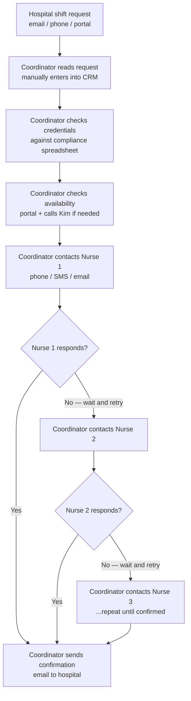
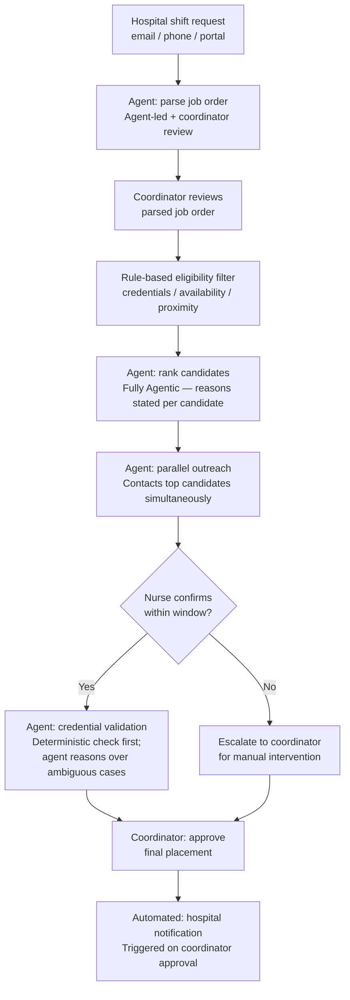
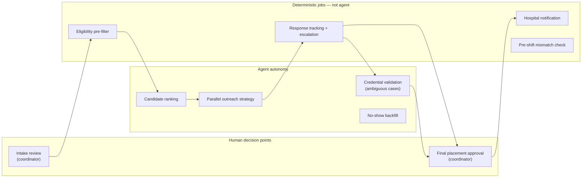

# D3 — Agentic Solution Architecture + ADRs
**MedFlex Engagement | Discovery: 2026-05-12**

---

## Assumptions

The architecture below rests on assumptions that were not confirmed during the discovery call. Each is rated by confidence level. Where confidence is Low, the assumption must be validated before the relevant design decision is treated as final.

| Assumption | Confidence | What changes if wrong | Validate with |
|---|---|---|---|
| The 4.2-hour fill time is predominantly waiting time (sequential outreach), not decision complexity | Low | Parallel outreach is the wrong primary lever. If coordinators spend 20–40 minutes actively researching each case, the agent must own the research and decision, not just the execution. The entire outreach-first architecture would need to be reconsidered. | Kim (lead coordinator) |
| Stale credential data is a material contributor to the 7% mismatch rate | Low | The real-time credential validation step addresses the wrong root cause. If the 7% is driven by hospital expectation mismatch or coordinator selection error, better job order intake parsing is the fix — not credential checking at placement time. ADR 2 and the credential validation workflow step would be deprioritised. | Linda (compliance) |
| The compliance system supports real-time per-nurse credential status queries via API | Low | ADR 2's primary design is not buildable. The agent falls back to reading quarterly batch state, which reintroduces the stale credential window it was designed to close. The <1h fill time target may be unachievable for credential-flagged cases under the fallback model. | Aaron (IT) |
| CRM and nurse portal data are accessible via API at placement time | Low | Agent cannot read placement history, nurse records, or availability status programmatically. The candidate ranking and eligibility filter steps would require a different data access model (batch export, manual lookup support). | Aaron (IT) |
| Nurse outreach confirmation (nurse says yes) is a reliable proxy for actual availability | Medium | If confirmed nurses still no-show at high rates (double-booking with competitors), outreach confirmation is not a sufficient safeguard. The architecture would need a hard-commitment mechanism — not just an outreach reply — before the placement is confirmed. | Kim / placement history data |
| Coordinators will accept the agent contacting nurses directly without approving the outreach list first | Medium | The coordinator gate would need to move earlier in the workflow — before outreach begins, not after a nurse confirms. This reintroduces a human bottleneck before the time-critical parallel outreach step and makes the <1h fill time target harder to achieve. | Coordinators (Kim's team) |

---

## Cognitive load split

Before mapping delegation levels, it helps to understand where human judgment currently lives. The coordination workflow splits roughly as follows:

| Zone | Share of workflow | What it involves | Agent suitability |
|---|---|---|---|
| **Rule-based execution** | ~45% | Eligibility filtering, response tracking, hospital notification, pre-shift credential check — outputs determined entirely by input data and fixed rules | Deterministic job or scheduled workflow; agent adds no value here |
| **Context-dependent reasoning** | ~35% | Candidate ranking, outreach sequencing under urgency, credential ambiguity resolution, no-show backfill — outputs depend on multiple factors that shift per job order | Genuinely agentic; a fixed rule cannot reach the right outcome reliably |
| **Human judgment** | ~20% | Final placement approval, exception handling, high-stakes decisions where accountability must remain with a person | Human only; agent prepares the information but does not act |

The prior recommendation engine failed by treating the context-dependent reasoning zone as if it were rule-based — it applied a fixed scoring algorithm to a context-sensitive decision. The agent design must apply reasoning only where it is justified and use deterministic jobs where it is not.

---

## Shift request lifecycle — current state vs. proposed state

### Current state (today)

Everything runs sequentially. The coordinator is the only actor. The 4.2-hour fill time is almost entirely waiting — waiting for nurses to respond, one at a time.

**Where the 4.2 hours goes:** sequential outreach with waiting between each contact attempt. The coordinator cannot move on to the next candidate until the previous one has been given time to respond. With 120 decisions per coordinator per day, this creates a backlog where new requests queue behind active fill cycles.

---

### Proposed state (with agent)

The coordinator is removed from the sequential outreach loop. The agent contacts multiple candidates simultaneously and brings the coordinator in only at the final approval gate.

**What changes:** parallel outreach collapses the waiting time. Pre-placement credential validation catches mismatches before confirmation. The coordinator touches the fill cycle twice (intake review, final approval) instead of owning every step.

---

## Agent boundary

---

## Data sources per workflow step

| Workflow step | Data required | Source system | Reliability at placement time |
|---|---|---|---|
| Intake parsing | Shift request text | Email inbox / phone note / CRM portal | Unstructured — parsing required for email and phone channels |
| Eligibility pre-filter | Credential status per nurse | Compliance system | Quarterly batch cadence — stale data risk; unconfirmed as mismatch driver |
| Eligibility pre-filter | Nurse availability | Nurse portal + manual updates via Kim | Mixed reliability — portal + phone updates not synchronised |
| Eligibility pre-filter | Nurse proximity to facility | Nurse record (static) | Reliable |
| Candidate ranking | Hospital preferences / nurse history | CRM (placement history) | Partially available — depends on how consistently coordinators log outcomes |
| Candidate ranking | Nurse response rate / no-show history | CRM | Available if coordinators have logged no-shows — to confirm with Aaron |
| Parallel outreach | Nurse contact details | Nurse record | Reliable |
| Credential validation | Credential detail + facility requirement text | Compliance system + CRM | Compliance system: stale risk. Facility requirements: may be informal — to confirm with Linda |
| Hospital notification | Hospital contact details | CRM | Reliable |

**Data risks requiring early validation with Aaron (IT):**
- CRM API access confirmed? If not, agent cannot read placement history or nurse records.
- Compliance system supports per-nurse real-time query? If not, ADR 2's primary approach falls back to the 2-hour SLA model.
- Nurse portal availability status exposed via API? If not, availability filter reads from manual updates only.

---

## Workflow delegation map

| Workflow step | Current method | Delegation level | Reason |
|---|---|---|---|
| Shift request intake — receive and parse unstructured request into structured job order | Coordinator reads email/phone/portal manually and enters into CRM | **Agent-led + human oversight** | Email and phone requests arrive in arbitrary natural language. A rule cannot reliably extract facility type, shift time, specialism, and credential requirements from variable-format input. Note: portal-sourced requests with structured form fields should use a deterministic extractor — the agent is only justified for unstructured channels. |
| Candidate eligibility pre-filter — credential match, portal availability, proximity | Coordinator checks each criterion manually per candidate | **Human-led + automation support** | The three filter criteria are deterministic: credential X required / nurse has credential X (Y/N); nurse availability status (Y/N); nurse within N miles (distance calc). These are rule-based lookups. The unreliability of availability data is a data quality problem, not a reason to make the filter agentic. Implement as a deterministic filter function. |
| Candidate ranking — order eligible candidates for coordinator review | No ranking system; coordinator decides based on experience | **Fully Agentic** | The right ranking depends on at least six context-dependent factors simultaneously: credential specificity for this facility type, proximity, hospital's preference history, nurse's response rate, nurse's no-show history at this facility, and current workload. No fixed rule can weight these correctly across all shift types and hospital relationships. Agent outputs a ranked shortlist with a stated reason per candidate — the reason is what the prior recommendation engine lacked. |
| Parallel outreach — contact top-ranked candidates simultaneously | Coordinator contacts one candidate at a time sequentially | **Agent-led + human oversight** | The outreach execution (sending message via SMS/email) is a deterministic automated action. The strategy — how many to contact, in what order, via which channel — is partially rule-based (contact top 3 by default) and partially agentic (adapt N upward when urgency is high or pool is shallow). The spec must distinguish the configurable rule from the urgency-adaptive reasoning. |
| Response tracking — monitor for confirmations within window | Coordinator monitors manually; follows up if no response | **Human-led + automation support** | If no confirmation is received within the target window, escalate to coordinator. This is a scheduled job: time threshold + status check + trigger notification. A deterministic workflow handles this more simply and reliably than an agent. |
| Credential validation at placement — verify credential fit before confirming candidate | Not currently done at placement time; mismatches detected post-shift only | **Agent-led + human oversight** | Exact match cases (credential A required / nurse has credential A, verified recently) are deterministic and should run first as a rule. Ambiguous cases — "ICU-certified preferred" vs nurse has "step-down ICU experience" — require the agent to reason over credential detail, facility requirements text, and precedent. The spec must define the boundary explicitly: deterministic check first; agent handles the residual ambiguous cases only. |
| Coordinator confirmation gate — final approval before hospital notification | Not applicable (coordinator already owns all decisions) | **Human only** | The final placement decision is the coordinator's. The agent surfaces the recommended match with rationale; the coordinator approves or overrides. This gate is non-negotiable in Wave 1. Two prior AI projects failed partly because coordinators did not trust machine outputs; removing this gate before trust is established will produce the same outcome. |
| Hospital notification — send confirmation once placement is approved | Coordinator sends confirmation email manually | **Human-led + automation support** | Triggered automatically on coordinator approval. Template + hospital contact + shift details = deterministic workflow. |
| No-show backfill — rapid replacement search when a placed nurse no-shows | Coordinator runs a manual "fire drill" | **Agent-led + human oversight** | Same candidate ranking logic as standard matching, but under a time constraint with a reduced pool. The urgency-weighting and reduced-pool adaptation cannot be captured in a fixed rule. The agent reasons over remaining pool state at the moment of backfill. |
| Pre-shift mismatch check — detect credential gap before shift begins | Currently only detected post-shift via hospital satisfaction survey | **Human-led + automation support** | Scheduled check T-hours before shift: compare placed nurse credentials against facility requirement record. Deterministic. Flag to coordinator if gap found. This is a scheduled job, not an agent — it replaces the current post-shift detection mechanism for a subset of credential mismatches. |

---

## Escalation triggers

| Trigger | Condition | Route to | Priority | SLA |
|---|---|---|---|---|
| No nurse confirmed within fill window | No nurse response received within 2 hours of outreach for a shift starting within 24h | Coordinator on duty | HIGH | 15 minutes |
| No nurse confirmed within fill window | No nurse response within 4 hours for a shift starting >24h away | Coordinator queue | MEDIUM | 1 hour |
| Credential ambiguity at placement | Agent cannot determine whether nurse meets facility requirement; no precedent in placement history | Coordinator + Linda (compliance) | HIGH | 30 minutes |
| Credential lapsed or stale | Nurse credential last verified >90 days ago or status flagged as lapsed | Compliance team (Linda) | MEDIUM | 2 hours (does not block other candidates) |
| No-show detected | Nurse has not arrived within 30 minutes of shift start | Coordinator on duty | HIGH | Immediate — backfill agent initiates in parallel |
| Pool exhausted | All eligible candidates contacted; no confirmations; pool empty | Coordinator on duty | HIGH | 15 minutes |
| Intake parsing ambiguity | Agent cannot extract complete structured job order from request | Coordinator | MEDIUM | 30 minutes |
| Data source unavailable | Compliance system or CRM unavailable at placement time | IT (Aaron) + coordinator | MEDIUM | 1 hour; agent holds fill cycle pending |

---

## Control handoffs

A control handoff is the moment where responsibility for a fill cycle transfers between the agent, the coordinator, and an automated system. Missing these in the spec causes the agent to either overstep or stall.

**Handoff 1: Hospital → Agent (Shift request received)**
- Signal: New shift request arrives via email, phone note, or portal
- What triggers it: Email webhook, phone note entry into CRM, or portal form submission
- Agent action: Parse and structure the job order; flag any fields it cannot extract

**Handoff 2: Agent → Coordinator (Intake review)**
- Signal: Job order parsed; agent returns structured record with confidence level
- Why: High-risk fields (facility type, required credentials, shift time) must be verified before filtering begins — a parsing error here propagates through the entire fill cycle
- Coordinator action: Confirm or correct the structured job order; approve to proceed

**Handoff 3: Agent → Coordinator (No fill within window)**
- Signal: Response tracking window expires; no nurse confirmed
- Why: Agent has exhausted parallel outreach; human judgment is needed to expand the pool, relax a requirement, or contact the hospital
- Coordinator action: Intervene directly; agent resumes if coordinator widens the search

**Handoff 4: Agent → Coordinator + Compliance (Credential ambiguity)**
- Signal: Agent flags a credential match as ambiguous; cannot determine eligibility from available data
- Why: Incorrect credential interpretation leads directly to the mismatch rate the engagement is trying to reduce
- Coordinator action: Confirm eligibility with Linda; agent holds the candidate pending resolution

**Handoff 5: Agent → Coordinator (Final placement approval)**
- Signal: Agent has a confirmed nurse response and a validated credential match
- Why: The placement decision is the coordinator's accountability; the hospital relationship is at stake
- Coordinator action: Review agent's ranked recommendation with stated reasons; approve or override

**Handoff 6: System → Coordinator (No-show detected)**
- Signal: Shift start time + 30 minutes; no arrival confirmation
- Why: A no-show requires immediate action; the agent initiates backfill but the coordinator must be aware and available to override
- Agent action: Initiates backfill ranking immediately in parallel; coordinator notified simultaneously

**Handoff 7: Agent → Compliance team (Stale credential flagged)**
- Signal: Nurse credential last verified >90 days ago detected during pre-filter
- Why: Compliance team must update before nurse can be placed; agent cannot verify credentials itself
- Agent action: Flags to Linda's team; continues processing other candidates; does not block the fill cycle

---

## ADR 1 — Coordinator approval gate at final placement

**Decision:** The agent handles intake parsing, eligibility filtering, candidate ranking, parallel outreach, and credential validation autonomously. The coordinator retains the final placement confirmation decision before the hospital is notified.

**Alternative A: Fully autonomous placement** — agent confirms placement with hospital directly without coordinator review.
- Consequences: Eliminates the human bottleneck entirely; fastest theoretical path to <1h fill time. However, if the agent makes a credential or judgment error, there is no human catch before a nurse is confirmed and the hospital is notified. Two prior AI projects eroded coordinator and management trust in machine outputs. A fully autonomous system that makes even occasional visible errors will be rejected faster than the previous recommendation engine was. Not viable in Wave 1.

**Alternative B: Coordinator reviews and approves every intermediate step** — coordinator approves the structured job order, shortlist, outreach list, and final placement.
- Consequences: Maximum oversight but reintroduces the coordinator as a bottleneck at every stage. Fill time improvement will be marginal; the 10x capacity target is unachievable because the coordinator's sequential approval recreates the current sequential workflow.

**Why the chosen option was selected:** The coordinator approval gate at the final step only removes the coordinator from the time-critical parallel work while preserving human accountability for the actual placement. The agent does the high-volume work; the coordinator makes the commitment. This is the minimum trust requirement given two prior failed AI projects and is the correct starting point for building coordinator confidence.

**Conditions that would require this decision to be revisited:** If coordinator approval time consistently adds more than 30 minutes to fill time across 30+ shifts, AND if agent first-recommendation acceptance rate exceeds 90% over 60 operational days, the gate can be relaxed for a defined subset of "clean" shift types (exact credential match, portal availability confirmed within 2 hours, nurse with zero no-show history at this facility).

---

## ADR 2 — Real-time credential validation at placement vs. reliance on compliance batch state

**Decision:** The agent triggers a real-time credential recency check against the compliance system at placement time for every candidate before they are ranked. Candidates with credentials last verified more than 90 days ago, or with a lapsed status, are excluded from the shortlist and flagged to the compliance team — this does not block other candidates from proceeding.

**Alternative A: Trust the compliance system's quarterly-updated credential state without additional checks.**
- Consequences: Simpler implementation. But the discovery call confirmed that credential re-verification happens within a week of a state regulatory ping — there is a window of up to 7 days where a nurse with a lapsed credential remains on the active roster. The agent would recommend and potentially place a nurse whose credential lapsed after the last quarterly update. This builds the same failure mode the current process already has into the architecture. *Note: stale credential data is a plausible but unconfirmed driver of the 7% mismatch rate — to be validated with Linda before this ADR is treated as the primary mismatch fix.*

**Alternative B: Route every placement through the compliance team for credential verification before proceeding.**
- Consequences: Eliminates credential lag at the cost of adding the compliance team to the critical path. If compliance team turnaround is not measured in minutes, the <1h fill time target is unachievable for any shift requiring verification. Also increases compliance team workload proportionally to shift volume — the opposite of the engagement mandate.

**Why the chosen option was selected:** A recency-gated check (credential last verified within 90 days?) is deterministic and fast — it does not require compliance team involvement for the common case where credentials are current. It only routes the exception to the compliance team. This eliminates the placement window for known-lapsed credentials without creating a human bottleneck for every shift.

**Conditions that would require this decision to be revisited:** If Aaron confirms the compliance system cannot support real-time API queries, the agent falls back to a soft-SLA model: flag placement as pending compliance confirmation, route to Linda's team with a 2-hour SLA. If Linda confirms that stale credentials are not a material driver of the 7% mismatch rate, the real-time validation step may be deprioritised in favour of better intake parsing of hospital requirements.
