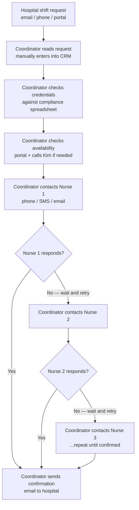
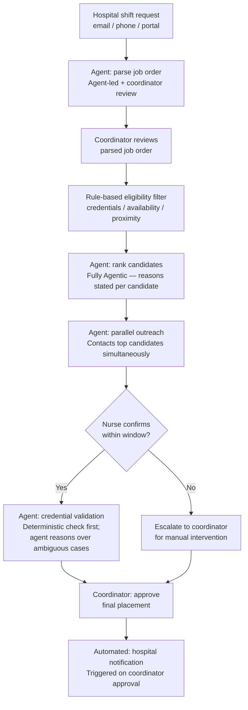
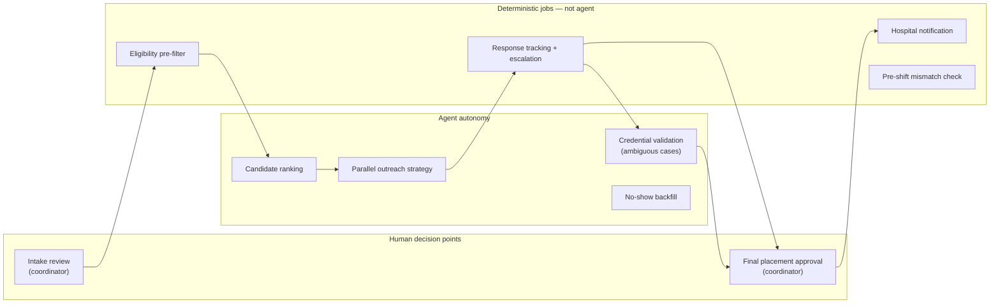

# MedFlex Engagement — Scenario Document
**Discovery: 2026-05-12 | Deliverables: D1 Problem Framing, D2 Intake & Scope, D3 Architecture**

---

# D1 — Problem Framing & Success Metrics

## Scenario summary

**Client:** MedFlex — healthcare staffing agency, 200 employees, 5-state US region. B2B with hospital systems; B2C with travel nurses. Of the 200 employees, 8 are coordinators responsible for manually matching nurses to hospital shift requests.

**Stakeholder:** Marcus Reyes, CEO. Series B closed. Board mandate: significant revenue growth within 24 months. Two prior AI projects failed (chatbot rejected by hospital staff; recommendation engine unused by coordinators).

**Engagement brief:** *"10x the business without 10x-ing the coordinators"* — in 8 weeks.

| Metric | Current state | Target | Timeframe |
|---|---|---|---|
| Coordinators | 8, matching manually | Flat headcount | Ongoing |
| Matching decisions per coordinator per day | ~120 | ~10x volume, same headcount | Wave 2 (post-MVP) |
| Average time to fill a shift | 4.2 hours | <1 hour | 6-week MVP pilot |
| Mismatch rate (wrong credentials for facility) | 7% | <2% | Wave 2 (post-MVP) |
| No-show rate | 12% | <7% | Wave 2 (post-MVP) |

---

## What is actually broken

- The matching workflow is entirely manual and sequential. Coordinators receive unstructured shift requests across email, phone, and portal, then manually check credentials, availability, and proximity before contacting nurses one at a time. The 4.2-hour fill time is waiting time, not decision time — the bottleneck is sequential outreach, not coordinator judgment.

- There is no pre-placement validation of credential fit. Mismatches (7%) are detected post-shift through hospital satisfaction surveys, not at the moment of placement. When no perfect match exists, MedFlex proposes a best-fit nurse without flagging to the hospital that it is not an exact match — this undisclosed substitution is a direct driver of the mismatch rate and the trust erosion with hospital clients.

- Availability and credential data are unreliable at the moment of placement. Nurse availability is split across a portal and ad-hoc phone updates (coordinators and Kim manually update). Credentials are maintained on a quarterly compliance cadence — creating a window where a nurse with a lapsed credential remains on the active roster and can be placed. Both introduce data lag that produces incorrect matches even when the coordinator follows the correct process.

---

## What "10x without 10x-ing" requires architecturally

Current ceiling: 8 coordinators × 120 decisions/day = **960 shift-fill cycles/day**. 10x revenue without headcount growth cannot be achieved by making coordinators faster — the math does not work.

| Scenario | Fill cycles/day | Coordinator active time/fill | Result |
|---|---|---|---|
| Current state | 960 | ~20 min (researching, calling sequentially, chasing) | Coordinator is the bottleneck |
| Agent assists (coordinator still in loop per step) | 960 | ~10 min | ~2x capacity — not 10x |
| Agent autonomous on clean cases (coordinator approves only final placement) | 9,600 | ~5 min per approval | 10x capacity with flat headcount — if ≥80% of fills are clean |

For the 10x target to be architecturally achievable, the agent must satisfy four requirements:

1. **Autonomous resolution rate ≥80%** — the agent resolves clean cases (exact credential match, portal availability confirmed, nurse responds within window) end-to-end, routing only exceptions and final approval to the coordinator.
2. **Intake to first outreach in <15 minutes** — the coordinator cannot sit between request receipt and nurse contact. The agent must parse and initiate outreach without waiting for coordinator review of each job order.
3. **Concurrent fill cycle capacity ≥9,600** — a synchronous, sequential agent (one fill at a time) cannot reach 10x volume. The agent must manage all active fill cycles in parallel, independently. Coordinators review a queue, not individual cycles.
4. **Coordinator active time <5 minutes per fill** — releasing coordinator capacity for the higher volume requires removing them from all steps except the final approval gate.

The 6-week MVP does not need to achieve 10x volume — it must demonstrate the architecture that enables it. A pilot demonstrating <1h fill time, ≥80% first-recommendation acceptance rate, and parallel outreach on 20–30 shifts is sufficient to validate the design.

---

## Success metrics

| Stakeholder | What success looks like | Measurable target | How it is measured |
|---|---|---|---|
| MedFlex (CEO / board) | Operational capacity scales without proportional headcount growth; board confidence in revenue trajectory | Fill volume per coordinator increased ≥3x within 6 weeks; coordinator headcount held flat | Shifts filled per coordinator per day, tracked in internal CRM |
| MedFlex coordinators | Routine matching is handled by the agent; coordinators spend time on exceptions and relationship decisions, not sequential phone calls | Fill time from request receipt to nurse confirmation: 4.2h → <1h | Average time-to-fill per shift, logged in CRM |
| Hospital clients | Right nurse for every shift; confirmed faster than competitor agencies | Mismatch rate: 7% → <2%; confirmation time: <1h | Post-shift satisfaction survey mismatch flag; time-to-confirmation log |
| Nurses | Matched to appropriate shifts; fewer last-minute cancellations from coordinators discovering a credential problem | No-show rate: 12% → <7% (Wave 2 target; Wave 1 mechanism is faster confirmation via parallel outreach only — pre-placement credential validation deferred to Wave 2) | No-show rate tracked per nurse in coordinator system |
| MedFlex compliance team | No increase in credential-related compliance exposure during pilot | Compliance team continues operating under current process during Wave 1 pilot; credential recency check at placement deferred to Wave 2 pending Linda's validation that stale credentials are a material mismatch driver | Compliance team confirms no new credential-related incidents during pilot period |

---

## How each metric is achieved

| Metric | Mechanism | Where demonstrated | Dependency / caveat |
|---|---|---|---|
| Fill time 4.2h → <1h | Parallel outreach replaces sequential outreach. The agent contacts multiple candidates simultaneously; the coordinator is removed from the outreach loop and touches the fill cycle only at intake review and final approval (~5 min active time vs. ~20 min today). The waiting time between sequential contact attempts — which is where the 4.2 hours comes from — is eliminated. The agentic component of outreach is not the sending (deterministic) but the real-time strategy adaptation: when pool is shallow, urgency is high, and some candidates are already in outreach for a concurrent fill, the agent reads live fill cycle state and adapts — contacting remaining available candidates immediately and escalating in parallel rather than waiting. A rule with no access to concurrent fill state cannot make this call. | Shift request lifecycle diagrams below; parallel outreach step in the workflow delegation map (Agent-led + human oversight — agentic component is urgency-adaptive strategy, not message sending); ADR 1; ADR 2 (agentic ranking with stated rationale builds coordinator trust in recommendations) | Low confidence — to validate with Kim. Three risks to the <1h target: (1) If fill time is partly decision work, impact depends on type — availability verification is the critical gap; if coordinators call nurses to confirm availability before shortlisting because portal data is unreliable, the agent inherits the same lag. (2) Nurse response time is the dominant time component — if nurses routinely take longer than 40 minutes to respond via any channel, the target is missed regardless of agent processing speed; channel choice and time-of-day patterns affect this materially (validate with pilot data from first 20–30 shifts). (3) Coordinator queue monitoring — if coordinators take 15–20 minutes to review a confirmation at high fill volume, the target is missed even when nurse response is fast; queue prioritisation by shift urgency is required (validate with Kim's team during workflow design). |
| Fill volume per coordinator ≥3x | At ~5 min coordinator active time per fill (approval gate only), a coordinator can supervise ~96 fills/day across an 8-hour day, vs. the current ~20 fills where they are actively engaged throughout each cycle. This is a ~4-5x capacity increase, which supports the ≥3x Wave 1 target. The candidate ranking step is the specific agentic decision that makes this sustainable: the agent adapts factor weighting per job order context (credential specificity dominates for specialist shifts; response rate and proximity dominate for urgent same-day fills) and produces a stated rationale per candidate. A fixed-weight sort produces the same ranking regardless of context and was already rejected by coordinators as untrustworthy. | Architectural requirements table above; ADR 1; ADR 2 | Wave 1 target only. 10x requires ≥80% autonomous resolution rate — not achieved until Wave 2 (see Wave 1 vs. Wave 2 scope below) |
| Mismatch rate 7% → <2% | Wave 1 mechanism: structured job order intake parsing captures hospital requirements more precisely, reducing ambiguous matches that become mismatches. Wave 2 mechanism (pending Linda validation): credential recency check at placement catches nurses with lapsed or stale credentials before confirmation. | Intake parsing step in workflow delegation map (LLM-assisted extraction, not agentic reasoning — handles input variability a deterministic parser cannot); D3 Wave 1/Wave 2 scope | **Wave 2 target.** Root cause of the 7% is unconfirmed — Marcus could not identify the breakdown. Credential recency check deferred pending Linda confirming stale credentials are a material driver. Wave 1 intake parsing alone is unlikely to move the mismatch rate to <2%; the target is achievable only when both mechanisms are in place. |
| No-show rate 12% → <7% | Wave 1 mechanism: parallel outreach secures nurse confirmation faster, closing the window in which a nurse can be double-booked by a competitor before MedFlex confirms — Marcus confirmed that some no-shows are nurses who accepted a competitor's booking first. Wave 2 mechanism (deferred): credential validation prevents placements where the nurse cannot legally fulfil the shift, removing a subset of no-shows caused by nurses declining on arrival. | Parallel outreach step in workflow delegation map; ADR 2 | **Wave 2 target.** Wave 1 parallel outreach alone addresses the competitor double-booking subset; the credential-related subset is not addressed until Wave 2. The specific 5pp reduction to reach <7% assumes both mechanisms; Wave 1 data will establish how much faster confirmation alone moves the rate. |
| Zero stale-credential placements | **Wave 2 only.** Credential recency check at placement time deferred pending Linda's confirmation that stale credentials are a material driver of the 7% mismatch rate and Aaron's confirmation of a queryable compliance system API. During Wave 1, the compliance team continues operating under its current quarterly cadence. Known risk: a small compliance exposure exists during the pilot — accepted as a condition of the 6-week timeline. | ADR 2 | Hard dependencies before Wave 2 build: (1) Linda validates stale credentials as mismatch driver; (2) Aaron confirms real-time compliance API. Neither confirmed at discovery. |

---

# D2 — Engagement Intake & Scope

## Business context

MedFlex is a 200-person healthcare staffing agency operating across 5 US states, matching travel nurses to hospital shift requests through 8 manual coordinators who collectively make ~960 matching decisions per day. This engagement exists because the current manual process cannot scale to meet the CEO's board-level revenue growth mandate: the coordination bottleneck is the ceiling on revenue, and two previous AI projects (chatbot, recommendation engine) failed to remove it.

---

## Stakeholder map

| Name / Role | What they care about | Their influence on this project |
|---|---|---|
| Marcus Reyes (CEO) | Revenue growth; board confidence; 10x capacity without 10x headcount | Primary decision-maker; approves scope, accepts or rejects deliverables; sceptical after two failed AI projects |
| Kim (lead coordinator, not in session) | Day-to-day matching workflow; accuracy of nurse availability data; managing exception cases | Defines how matching actually runs in practice; availability data flows through her; key for lived-process validation |
| Aaron (IT, not in session) | Internal systems; CRM; portal architecture; API availability | Determines what data the agent can access; API access for CRM, compliance system, and availability portal unconfirmed |
| Linda (compliance, not in session) | Credential accuracy; state regulatory requirements; quarterly update cadence | Defines credential data structure and update frequency; stale credential data is a plausible mismatch driver but root-cause attribution is unconfirmed — Marcus could not identify the breakdown; must be validated with Linda before the credential validation step is treated as the primary mismatch fix |
| 8 coordinators | Reduced manual workload; recommendations they can trust | Adoption gatekeepers — the recommendation engine failed because coordinators did not trust it; agent design must address this |
| Hospital clients | Right nurse confirmed quickly; better than competitor agencies | Satisfaction survey data is the only current mismatch signal; their switching risk drives urgency |
| Nurses (travel nurses) | Matched to appropriate shifts; confirmed commitments | Their availability and response behaviour drives fill time; no-shows partly caused by double-booking with competitors |

---

## Constraints

- 8 weeks to demonstrable, measurable results (board-level confidence required; MVP definition is FDE's to propose)
- 5-state US region: credential requirements vary by state; agent must apply per-state rules, not a single national standard
- Credential data maintained on quarterly cadence by compliance team — real-time credential status cannot be assumed without a validated API
- CRM/internal portal API access not confirmed — Aaron (IT) must verify before architecture is finalised
- Compliance team (not coordinators) owns credential verification — agent cannot modify credential records; it can only read and flag
- Nurse availability is split across a portal and manual phone updates — availability data must be treated as indicative, not authoritative, until a single source of truth is confirmed with Kim
- No changes to hospital-facing channels (email/phone/portal) in scope — hospitals continue submitting requests as they do today
- No changes to nurse-facing channels in scope — nurses continue to be reached by phone, SMS, or email

---

## Risks

| Risk | Likelihood | Impact | Mitigation |
|---|---|---|---|
| Availability data is stale at placement time (portal + manual phone updates create lag) | High | High | Agent treats portal availability as indicative; confirms via outreach before committing a placement |
| Stale credential data (quarterly update cadence creates a window where lapsed credentials remain on the active roster) — unconfirmed as primary mismatch driver; Marcus could not confirm root-cause breakdown | Medium | High | Agent checks credential status at placement time; excludes candidates with credentials last verified >90 days; flags to compliance team. Likelihood downgraded from High to Medium until Linda confirms stale credential data is a material contributor to the 7% mismatch rate |
| Coordinator distrust of agent recommendations (recommendation engine failed for same reason) | High | Medium | Agent must surface ranking rationale per candidate — not just a ranked list; coordinators must see why, not just who |
| CRM / compliance system API access unavailable or restricted | Medium | High | Engage Aaron in week 1 to confirm; design agent with abstracted data layer so API stubs can be replaced without architecture change |
| State-level credential variation causes incorrect eligibility decisions | Medium | High | Linda (compliance) provides credential-to-facility-type mapping per state before build; agent applies it but does not interpret it |
| No pre-placement mismatch signal — mismatches currently only known post-shift | High | High | Add pre-placement credential validation step; flag best-fit matches as partial match with explicit reason shown to coordinator |
| Agent accuracy insufficient for coordinator trust in first 8 weeks | Medium | Medium | Wave 1 targets measurable fill-time reduction, not full autonomy; coordinator remains in approval loop throughout |
| Nurses double-booked with competitor apps (contributing to 12% no-show rate) | Medium | Medium | Parallel outreach gets confirmation faster; confirmed nurses are removed from the available pool immediately |

---

## MVP scope — IN

- **Job order intake parsing**: extract structured data (facility, shift date/time, specialism, required credentials) from unstructured shift requests arriving by email, phone note, or portal
- **Candidate eligibility pre-filter**: rule-based filter on three deterministic criteria — credentials match, availability (portal state), proximity within facility's region
- **Candidate ranking**: agent-led ranking of eligible candidates with stated rationale per candidate (why this nurse for this shift)
- **Parallel outreach**: contact top-ranked candidates simultaneously via existing channels (phone, SMS, email); do not wait for one response before contacting the next
- **Response tracking and escalation**: track nurse responses against a target confirmation window; escalate to coordinator if no confirmation within threshold
- **Coordinator confirmation gate**: surface confirmed match to coordinator with agent rationale before hospital is notified; coordinator approves or overrides
- **Hospital confirmation notification**: send confirmation to hospital on coordinator approval via email

---

## MVP scope — OUT

| Out of scope | Reason |
|---|---|
| Hospital-facing portal for shift submission | Named explicitly in brief; hospitals submit by email/phone/portal today and this engagement does not change that channel |
| Nurse-facing mobile app | Named explicitly in brief; separate product surface requiring separate discovery with nurses |
| Pricing engine and margin optimisation | Named explicitly in brief; pricing remains MedFlex's existing process |
| Continuing-education renewal automation for nurses | Named explicitly in brief; nurse development is a separate domain from shift matching |
| Credential renewal reminders to nurses | Compliance team's responsibility; agent reads credential state but does not manage the renewal lifecycle |
| Hospital sales and business development | Marcus confirmed this is the growth team's scope; operational efficiency is the agent's scope |
| Post-shift mismatch analysis and root-cause attribution | Requires historical data pipeline separate from the real-time matching workflow; deferred to Wave 2 |
| Credential recency check at placement time | Root cause of 7% mismatch rate unconfirmed — to be validated with Linda before build. Compliance team continues handling credentials under current process during pilot. Known risk: small compliance exposure accepted for the 6-week pilot; hard dependency for production deployment. Deferred to Wave 2. |
| No-show backfill agent | Reactive exception path not needed to demonstrate core fill-time architecture in Wave 1; coordinator handles backfill manually as today |
| Pre-shift mismatch check | Depends on credential validation infrastructure deferred to Wave 2 |
| Coordinator NPS / internal satisfaction tracking | Discovery confirmed pain point is fill time; coordinator experience improvement is a downstream effect, not a primary agent goal |
| Multi-state regulatory interpretation | Agent applies compliance team's credential mapping per state; it does not interpret ambiguous regulatory requirements — those are escalated to Linda |

---

# D3 — Agentic Architecture & ADRs

## Wave 1 vs. Wave 2 scope

The architecture is designed across two waves. Wave 1 demonstrates the design works and builds coordinator trust. Wave 2 removes the remaining human bottleneck for the high-volume clean cases.

| | Wave 1 (6-week pilot) | Wave 2 |
|---|---|---|
| **Goal** | Demonstrate measurable fill-time reduction; validate the architecture | Achieve 10x capacity with flat coordinator headcount |
| **Coordinator role** | Approves every final placement — in the critical path for 100% of fills | Approves exceptions only; agent confirms clean cases autonomously |
| **Autonomous resolution rate** | Low — agent handles matching and outreach; human handles every approval | ≥80% — required to unlock 10x capacity (see architectural requirements above) |
| **Agent confirmation of placement** | Never — coordinator confirms with hospital | For clean cases only: exact credential match, availability confirmed within 2h, nurse with zero no-show history at this facility |
| **In scope** | Intake parsing, eligibility pre-filter, agentic candidate ranking with rationale, parallel outreach, response tracking, coordinator confirmation gate, hospital notification | Credential recency check at placement, no-show backfill agent, pre-shift mismatch check, ≥80% autonomous resolution |
| **Trigger to move to Wave 2** | Coordinator approval adds <30 min to fill time consistently AND agent first-recommendation acceptance rate ≥90% over 60 operational days | |
| **Timeline dependency** | Aaron confirms CRM and nurse portal API access in week 1. If APIs are unavailable, timeline does not compress. | |

**Why Wave 1 keeps the coordinator in the approval loop for all placements:** two prior AI projects failed and coordinator trust in machine outputs is low. An autonomous system that makes visible errors in the first weeks will be rejected faster than the recommendation engine was. Wave 1 proves accuracy; Wave 2 delegates on the back of that proof.

**Why Wave 1 still achieves fill-time reduction despite coordinator approval:** the bottleneck is not the approval decision — it is the sequential outreach. The agent removes the coordinator from the outreach loop. Coordinator active time per fill drops from ~20 minutes (researching, calling sequentially, chasing) to ~5 minutes (reviewing agent rationale and approving). Fill time drops from 4.2 hours to <1 hour because parallel outreach collapses the waiting, not because the human is removed from the final step.

---

## Delivery timeline

### Wave 1 — 6-week pilot

| Weeks | Activity | Gate |
|---|---|---|
| Week 1 | Aaron confirms CRM and nurse portal APIs; Kim validates fill time breakdown and availability data reliability; Linda consulted on credential mismatch root cause | If APIs unconfirmed by end of week 1, timeline slips — this is the hard dependency |
| Weeks 2–5 | Build: LLM-assisted intake parser, deterministic eligibility filter, candidate ranking agent, parallel outreach automation, response tracking scheduler, coordinator approval interface, hospital notification | Integration with CRM and outreach channels (SMS, email, phone) |
| Week 6 | Pilot on 20–30 live shifts; fill time and coordinator acceptance rate tracked | Board presentation: early directional data, not statistically significant proof |

**Pilot selection criteria for week 6:**

The 20–30 shifts are a structured sample, not a random cross-section of all fills. Selection criteria limit exposure while producing meaningful data:

| Criterion | Scope | Rationale |
|---|---|---|
| Coordinators | 1–2 from Kim's team | Limits blast radius; keeps the pilot controllable and debriefable |
| Shift type | Standard fills with >24h lead time, known facility types, standard credentials only | Excludes urgent same-day fills and specialist high-acuity shifts where a failure carries the highest relationship risk |
| Hospital clients | 2–3 accounts with established MedFlex relationships | Ensures a slower or failed fill during the pilot does not immediately cost a contract |
| Coordinator role | Approves every placement, as per Wave 1 design | Agent never confirms with the hospital unilaterally during the pilot |

**What is measured across the 20–30 shifts:**
- Average fill time from intake to hospital confirmation
- First-recommendation acceptance rate: did the coordinator approve the agent's top-ranked nurse, or override?
- Escalation path frequency: how many fills hit each escalation type (no confirmation within window, pool exhausted, parsing ambiguity)

**Realistic results at week 6:**

| Outcome | Realistic range | What determines it |
|---|---|---|
| Fill time | 40 min–2 hours | Nurse response time (dominant factor) and coordinator queue monitoring; <1h if both assumptions hold |
| Fill volume per coordinator | ≥3x | Achievable if coordinators are genuinely released from the outreach loop |
| Coordinator acceptance rate | Unknown until pilot | First-recommendation acceptance rate is the leading indicator for Wave 2 readiness |
| Board deliverable | Architecture demonstrated on live shifts | 20–30 shifts shows the design works; not enough to prove 10x capacity |

---

### Wave 2 — condition-triggered, estimated months 5–8

Wave 2 has no fixed start date. It is triggered when Wave 1 data meets both conditions: coordinator approval adds <30 minutes to fill time consistently **and** agent first-recommendation acceptance rate ≥90% over 60 operational days.

| Phase | Timing | Activity |
|---|---|---|
| Wave 1 operational | Months 2–5 | Run live; collect 60 operational days of acceptance rate and approval time data |
| Wave 2 trigger assessment | Month 5 | Review data against both trigger conditions; if not met, Wave 2 is delayed until conditions are satisfied |
| Wave 2 build | Months 5–7 | Credential recency check (requires Aaron's compliance API confirmation); no-show backfill agent; pre-shift mismatch check; ≥80% autonomous resolution path for clean cases |
| Wave 2 live | Month 7–8 | Full autonomous resolution for clean cases; coordinator approves exceptions only |

**Realistic results at Wave 2:**

| Outcome | Target | Dependency |
|---|---|---|
| Autonomous resolution rate | ≥80% of fills | Clean case definition must hold in production: exact credential match + availability confirmed + zero no-show history |
| Fill time | <1 hour (maintained) | Nurse response time and coordinator queue assumptions carry forward |
| Mismatch rate | 7% → <2% | Only if Linda confirms stale credentials are a material driver and recency check is built |
| No-show rate | 12% → <7% | Both mechanisms in place: faster confirmation (Wave 1) + credential validation (Wave 2) |
| Coordinator headcount | Flat | 10x capacity with same headcount — achievable only if ≥80% autonomous resolution holds |

**Risk to board mandate:** Wave 2 going live at month 7–8 leaves 16–17 months of operation within the 24-month revenue growth window — sufficient if Wave 1 trigger conditions are met at month 5. If Wave 1 data does not meet trigger conditions, Wave 2 is delayed and the operational window before the board's deadline compresses.

---

## Assumptions

The architecture below rests on assumptions that were not confirmed during the discovery call. Each is rated by confidence level. Where confidence is Low, the assumption must be validated before the relevant design decision is treated as final.

| Assumption | Confidence | What changes if wrong | Validate with |
|---|---|---|---|
| The 4.2-hour fill time is predominantly waiting time (sequential outreach), not decision complexity | Low | If partly wrong, impact depends on which decision work is involved. Credential checking, requirement interpretation, and nurse selection are already addressed by the eligibility filter, intake parser, and ranking agent — so those decision tasks are eliminated regardless. The critical gap is availability verification: if coordinators currently call nurses to confirm availability before shortlisting because portal data is unreliable, the agent inherits the same stale data and the same lag. In that case, parallel outreach reduces waiting time but does not eliminate the verification bottleneck, and the <1h target becomes a validated outcome rather than a guaranteed one. If the 4.2 hours is mostly active research (not outreach waiting), the architecture would need to be reconsidered more substantially — but most of that research is already in scope for the agent. Key question for Kim: of the 4.2 hours, how much is waiting for nurse responses vs. actively verifying availability or credentials before making contact? | Kim (lead coordinator) |
| Stale credential data is a material contributor to the 7% mismatch rate | Low | The real-time credential validation step addresses the wrong root cause. If the 7% is driven by hospital expectation mismatch or coordinator selection error, better job order intake parsing is the fix — not credential checking at placement time. ADR 2 and the credential validation workflow step would be deprioritised. | Linda (compliance) |
| The compliance system supports real-time per-nurse credential status queries via API | Low | ADR 2's primary design is not buildable. The agent falls back to reading quarterly batch state, which reintroduces the stale credential window it was designed to close. The <1h fill time target may be unachievable for credential-flagged cases under the fallback model. | Aaron (IT) |
| CRM and nurse portal data are accessible via API at placement time | Low | Agent cannot read placement history, nurse records, or availability status programmatically. The candidate ranking and eligibility filter steps would require a different data access model (batch export, manual lookup support). | Aaron (IT) |
| Nurse outreach confirmation (nurse says yes) is a reliable proxy for actual availability | Medium | If confirmed nurses still no-show at high rates (double-booking with competitors), outreach confirmation is not a sufficient safeguard. The architecture would need a hard-commitment mechanism — not just an outreach reply — before the placement is confirmed. | Kim / placement history data |
| Coordinators will accept the agent contacting nurses directly without approving the outreach list first | Medium | The coordinator gate would need to move earlier in the workflow — before outreach begins, not after a nurse confirms. This reintroduces a human bottleneck before the time-critical parallel outreach step and makes the <1h fill time target harder to achieve. | Coordinators (Kim's team) |
| Nurses respond to parallel outreach within ~30–40 minutes via at least one contact channel | Low | Nurse response time is the dominant component of the <1h fill time. If nurses routinely take longer than 40 minutes to respond — due to being mid-shift, ignoring SMS, or not checking email — the fill time target is missed regardless of how fast the agent processes the job order. Channel choice (SMS vs. email vs. phone) and time-of-day patterns materially affect this. | Kim / pilot data from first 20–30 shifts |
| Coordinators are actively monitoring the confirmation queue and can approve within ~5 minutes of a nurse confirming | Medium | At high fill volume, coordinators managing multiple concurrent fill cycles may not see a new confirmation immediately. If coordinator review adds 15–20 minutes rather than 5, the <1h target is missed even when nurse response is fast. Queue prioritisation by shift urgency (not first-in first-out) is required to protect the target for time-critical fills. | Kim's team / coordinator workflow design |

---

## Cognitive load split

Before mapping delegation levels, it helps to understand where human judgment currently lives. The coordination workflow splits roughly as follows:

| Zone | Share of workflow | What it involves | Agent suitability |
|---|---|---|---|
| **Rule-based execution** | ~45% | Eligibility filtering, response tracking, hospital notification, pre-shift credential check — outputs determined entirely by input data and fixed rules | Deterministic job or scheduled workflow; agent adds no value here |
| **Context-dependent reasoning** | ~35% | Candidate ranking, outreach sequencing under urgency, credential ambiguity resolution, no-show backfill — outputs depend on multiple factors that shift per job order | Genuinely agentic; a fixed rule cannot reach the right outcome reliably |
| **Human judgment** | ~20% | Final placement approval, exception handling, high-stakes decisions where accountability must remain with a person | Human only; agent prepares the information but does not act |

The prior recommendation engine failed by treating the context-dependent reasoning zone as if it were rule-based — it applied a fixed scoring algorithm to a context-sensitive decision. The agent design must apply reasoning only where it is justified and use deterministic jobs where it is not.

---

## Shift request lifecycle — current state vs. proposed state

### Current state (today)

Everything runs sequentially. The coordinator is the only actor. The 4.2-hour fill time is almost entirely waiting — waiting for nurses to respond, one at a time.

**Where the 4.2 hours goes:** sequential outreach with waiting between each contact attempt. The coordinator cannot move on to the next candidate until the previous one has been given time to respond. With 120 decisions per coordinator per day, this creates a backlog where new requests queue behind active fill cycles.

---

### Proposed state (with agent)

The coordinator is removed from the sequential outreach loop. The agent contacts multiple candidates simultaneously and brings the coordinator in only at the final approval gate.

**What changes:** parallel outreach collapses the waiting time. Pre-placement credential validation catches mismatches before confirmation. The coordinator touches the fill cycle twice (intake review, final approval) instead of owning every step.

---

## Agent boundary

---

## Data sources per workflow step

| Workflow step | Data required | Source system | Reliability at placement time |
|---|---|---|---|
| Intake parsing | Shift request text | Email inbox / phone note / CRM portal | Unstructured — parsing required for email and phone channels |
| Eligibility pre-filter | Credential status per nurse | Compliance system | Quarterly batch cadence — stale data risk; unconfirmed as mismatch driver |
| Eligibility pre-filter | Nurse availability | Nurse portal + manual updates via Kim | Mixed reliability — portal + phone updates not synchronised |
| Eligibility pre-filter | Nurse proximity to facility | Nurse record (static) | Reliable |
| Candidate ranking | Hospital preferences / nurse history | CRM (placement history) | Partially available — depends on how consistently coordinators log outcomes |
| Candidate ranking | Nurse response rate / no-show history | CRM | Available if coordinators have logged no-shows — to confirm with Aaron |
| Parallel outreach | Nurse contact details | Nurse record | Reliable |
| Credential validation | Credential detail + facility requirement text | Compliance system + CRM | Compliance system: stale risk. Facility requirements: may be informal — to confirm with Linda |
| Hospital notification | Hospital contact details | CRM | Reliable |

**Data risks requiring early validation with Aaron (IT):**
- CRM API access confirmed? If not, agent cannot read placement history or nurse records.
- Compliance system supports per-nurse real-time query? If not, ADR 2's primary approach falls back to the 2-hour SLA model.
- Nurse portal availability status exposed via API? If not, availability filter reads from manual updates only.

---

## Workflow delegation map

| Workflow step | Current method | Delegation level | Reason |
|---|---|---|---|
| Shift request intake — receive and parse unstructured request into structured job order | Coordinator reads email/phone/portal manually and enters into CRM | **LLM-assisted extraction + human oversight** | This is structured extraction from variable-format input, not agent reasoning. The LLM handles the variability of free-text email and phone notes that a deterministic parser cannot reliably process — extracting facility type, shift time, specialism, and credential requirements from arbitrary natural language. It does not reason over context to reach a decision a rule couldn't reach; it extracts fields a rule would misparse. Portal-sourced requests with structured form fields use a deterministic extractor — the LLM is only justified for unstructured channels. High-confidence extractions auto-proceed; low-confidence or ambiguous parses route to the coordinator (Handoff 2). This step is distinct from the candidate ranking agent: extraction produces a structured record; the ranking agent reasons over that record to make a context-dependent decision. |
| Candidate eligibility pre-filter — credential match, portal availability, proximity | Coordinator checks each criterion manually per candidate | **Human-led + automation support** | The three filter criteria are deterministic: credential X required / nurse has credential X (Y/N); nurse availability status (Y/N); nurse within N miles (distance calc). These are rule-based lookups. The unreliability of availability data is a data quality problem, not a reason to make the filter agentic. Implement as a deterministic filter function. |
| Candidate ranking — order eligible candidates for coordinator review | No ranking system; coordinator decides based on experience | **Fully Agentic** | The right ranking depends on at least six context-dependent factors simultaneously: credential specificity for this facility type, proximity, hospital's preference history, nurse's response rate, nurse's no-show history at this facility, and current workload. A deterministic sort applies fixed weights to these factors — but the correct weights shift per job order context, and a rule cannot encode those shifts without becoming a lookup table that grows without bound and still fails on novel combinations. **Worked example:** a specialist ICU shift 48 hours away with a rare credential required has a deep pool. Credential specificity is the dominant factor; response rate is secondary because there is time to chase. The agent ranks Nurse A (exact credential match, 25 miles, 85% response rate) above Nurse B (near-match credential, 3 miles, 95% response rate). For an urgent same-day fill of the same facility with a shallow pool, the agent inverts this: Nurse B's proximity and response rate dominate because the fill window is 2 hours, not 48. A deterministic sort with fixed weights would produce the same ranking in both cases and be wrong in one of them. The agent outputs a stated rationale per candidate — "exact credential match for this facility type; proximity secondary given 48h window" — which is what the prior recommendation engine lacked and what allows the coordinator to interrogate rather than just accept the ranking. |
| Parallel outreach — contact top-ranked candidates simultaneously | Coordinator contacts one candidate at a time sequentially | **Agent-led + human oversight** | The outreach execution (sending message via SMS/email) is a deterministic automated action. The default strategy (contact top 3) is a configurable rule. The agentic component is real-time adaptation when multiple conditions interact simultaneously: shallow pool + high urgency + some candidates already contacted for a concurrent fill. A rule cannot handle this combination without access to live state across all active fill cycles. **Worked example:** shift starts in 3 hours; pool has 4 eligible nurses; 2 are already in the outreach window for a different concurrent fill. A rule says "contact top 3" — but contacting nurses already committed to another fill wastes the outreach window. The agent reads current fill cycle state, excludes the 2 already in outreach, contacts the remaining 2 immediately, and escalates to the coordinator in parallel rather than waiting for the response window to expire — because with only 2 available candidates and 3 hours to fill, waiting is not viable. A rule with no access to concurrent fill state cannot make this call. |
| Response tracking — monitor for confirmations within window | Coordinator monitors manually; follows up if no response | **Human-led + automation support** | If no confirmation is received within the target window, escalate to coordinator. This is a scheduled job: time threshold + status check + trigger notification. A deterministic workflow handles this more simply and reliably than an agent. |
| Credential validation at placement — verify credential fit before confirming candidate | Not currently done at placement time; mismatches detected post-shift only | **Agent-led + human oversight** | Exact match cases (credential A required / nurse has credential A, verified recently) are deterministic and should run first as a rule. Ambiguous cases — "ICU-certified preferred" vs nurse has "step-down ICU experience" — require the agent to reason over credential detail, facility requirements text, and precedent. The spec must define the boundary explicitly: deterministic check first; agent handles the residual ambiguous cases only. |
| Coordinator confirmation gate — final approval before hospital notification | Not applicable (coordinator already owns all decisions) | **Human only** | The final placement decision is the coordinator's. The agent surfaces the recommended match with rationale; the coordinator approves or overrides. This gate is non-negotiable in Wave 1. Two prior AI projects failed partly because coordinators did not trust machine outputs; removing this gate before trust is established will produce the same outcome. |
| Hospital notification — send confirmation once placement is approved | Coordinator sends confirmation email manually | **Human-led + automation support** | Triggered automatically on coordinator approval. Template + hospital contact + shift details = deterministic workflow. |
| No-show backfill — rapid replacement search when a placed nurse no-shows | Coordinator runs a manual "fire drill" | **Agent-led + human oversight** | Same candidate ranking logic as standard matching, but under a time constraint with a reduced pool. The urgency-weighting and reduced-pool adaptation cannot be captured in a fixed rule. The agent reasons over remaining pool state at the moment of backfill. |
| Pre-shift mismatch check — detect credential gap before shift begins | Currently only detected post-shift via hospital satisfaction survey | **Human-led + automation support** | Scheduled check T-hours before shift: compare placed nurse credentials against facility requirement record. Deterministic. Flag to coordinator if gap found. This is a scheduled job, not an agent — it replaces the current post-shift detection mechanism for a subset of credential mismatches. |

---

## Escalation triggers

| Trigger | Condition | Route to | Priority | SLA |
|---|---|---|---|---|
| No nurse confirmed within fill window | No nurse response received within 2 hours of outreach for a shift starting within 24h | Coordinator on duty | HIGH | 15 minutes |
| No nurse confirmed within fill window | No nurse response within 4 hours for a shift starting >24h away | Coordinator queue | MEDIUM | 1 hour |
| Credential ambiguity at eligibility filter | Agent cannot determine whether nurse holds the required credential type from available records | Coordinator | HIGH | 30 minutes |
| No-show detected | Nurse has not arrived within 30 minutes of shift start | Coordinator on duty | HIGH | Immediate — coordinator initiates backfill manually; see failure path below |
| Pool exhausted | All eligible candidates contacted; no confirmations; pool empty | Coordinator on duty | HIGH | 15 minutes |
| Intake parsing ambiguity | Agent cannot extract complete structured job order from request | Coordinator | MEDIUM | 30 minutes |
| Data source unavailable | CRM or nurse portal unavailable at placement time | IT (Aaron) + coordinator | MEDIUM | 1 hour; agent holds fill cycle pending |

---

## Failure path — hospital communication

When a fill cycle fails or is delayed, the coordinator owns the hospital relationship. The agent's role in failure is to give the coordinator everything they need to have that conversation quickly. The agent does not contact the hospital directly under any circumstances.

| Failure mode | Agent action | Coordinator action | Hospital notification SLA |
|---|---|---|---|
| No nurse confirmed within fill window | Escalate to coordinator; surface remaining pool state, time to shift start, and pre-drafted status message | Expand pool, relax a requirement, or contact hospital directly using existing relationship | Coordinator notifies hospital within 30 minutes of escalation if no fill is imminent; agent pre-drafts message for coordinator review |
| Pool exhausted | Escalate immediately with shift details, gap summary, and list of options (defer shift, relax requirement, source externally) | Contact hospital directly; discuss options | Coordinator calls hospital within 15 minutes of pool-exhausted escalation |
| Agent parsing error or wrong match caught at coordinator approval gate | Surface discrepancy to coordinator with original request text and parsed record side by side; flag specific field(s) in conflict | Correct the record and rerun, or take over the fill manually | No hospital notification — hospital is not informed of internal errors; coordinator continues fill cycle without disclosing the parsing failure |
| No-show post-placement | Escalate to coordinator immediately with shift details and time elapsed since shift start | Contact hospital to set expectation; initiate manual backfill search | Coordinator notifies hospital within 15 minutes of no-show detection, before a replacement is confirmed |

---

## Control handoffs

A control handoff is the moment where responsibility for a fill cycle transfers between the agent, the coordinator, and an automated system. Missing these in the spec causes the agent to either overstep or stall.

**Handoff 1: Hospital → Agent (Shift request received)**
- Signal: New shift request arrives via email, phone note, or portal
- What triggers it: Email webhook, phone note entry into CRM, or portal form submission
- Agent action: Parse and structure the job order; flag any fields it cannot extract

**Handoff 2: Agent → Coordinator (Intake review — low-confidence parses only)**
- Signal: Job order parsed; one or more required fields (facility type, required credentials, shift time) extracted below confidence threshold or flagged as ambiguous
- Why: A parsing error in a high-risk field propagates through the entire fill cycle — wrong candidates ranked, wrong nurses contacted. Coordinator review is only warranted when the agent is uncertain; high-confidence parses auto-proceed to eligibility filtering without this handoff
- Coordinator action: Confirm or correct the flagged fields; approve to proceed. Agent continues autonomously once corrected record is confirmed

**Handoff 3: Agent → Coordinator (No fill within window)**
- Signal: Response tracking window expires; no nurse confirmed
- Why: Agent has exhausted parallel outreach; human judgment is needed to expand the pool, relax a requirement, or contact the hospital
- Coordinator action: Intervene directly; agent resumes if coordinator widens the search

**Handoff 4: Agent → Coordinator + Compliance (Credential ambiguity)**
- Signal: Agent flags a credential match as ambiguous; cannot determine eligibility from available data
- Why: Incorrect credential interpretation leads directly to the mismatch rate the engagement is trying to reduce
- Coordinator action: Confirm eligibility with Linda; agent holds the candidate pending resolution

**Handoff 5: Agent → Coordinator (Final placement approval)**
- Signal: Agent has a confirmed nurse response and a validated credential match
- Why: The placement decision is the coordinator's accountability; the hospital relationship is at stake
- Coordinator action: Review agent's ranked recommendation with stated reasons; approve or override

**Handoff 6: System → Coordinator (No-show detected)**
- Signal: Shift start time + 30 minutes; no arrival confirmation
- Why: A no-show requires immediate action; the agent initiates backfill but the coordinator must be aware and available to override
- Agent action: Initiates backfill ranking immediately in parallel; coordinator notified simultaneously

**Handoff 7: Agent → Compliance team (Stale credential flagged)**
- Signal: Nurse credential last verified >90 days ago detected during pre-filter
- Why: Compliance team must update before nurse can be placed; agent cannot verify credentials itself
- Agent action: Flags to Linda's team; continues processing other candidates; does not block the fill cycle

---

## ADR 1 — Coordinator approval gate at final placement

**Type:** Governance — determines where human accountability sits in the workflow, not whether to use an agent or a deterministic rule.

**Decision:** The agent handles intake parsing, eligibility filtering, candidate ranking, and parallel outreach autonomously. The coordinator retains the final placement confirmation decision before the hospital is notified.

**Alternative A: Fully autonomous placement** — agent confirms placement with hospital directly without coordinator review.
- Consequences: Eliminates the human bottleneck entirely; fastest theoretical path to <1h fill time. However, if the agent makes a credential or judgment error, there is no human catch before a nurse is confirmed and the hospital is notified. Two prior AI projects eroded coordinator and management trust in machine outputs. A fully autonomous system that makes even occasional visible errors will be rejected faster than the previous recommendation engine was. Not viable in Wave 1.

**Alternative B: Coordinator reviews and approves every intermediate step** — coordinator approves the structured job order, shortlist, outreach list, and final placement.
- Consequences: Maximum oversight but reintroduces the coordinator as a bottleneck at every stage. Fill time improvement will be marginal; the 10x capacity target is unachievable because the coordinator's sequential approval recreates the current sequential workflow.

**Why the chosen option was selected:** The coordinator approval gate at the final step only removes the coordinator from the time-critical parallel work while preserving human accountability for the actual placement. The agent does the high-volume work; the coordinator makes the commitment. This is the minimum trust requirement given two prior failed AI projects and is the correct starting point for building coordinator confidence.

**Conditions that would require this decision to be revisited:** If coordinator approval time consistently adds more than 30 minutes to fill time across 30+ shifts, AND if agent first-recommendation acceptance rate exceeds 90% over 60 operational days, the gate can be relaxed for a defined subset of "clean" shift types (exact credential match, portal availability confirmed within 2 hours, nurse with zero no-show history at this facility).

---

## ADR 2 — Candidate ranking: agentic reasoning with stated rationale vs. deterministic sort

**Type:** Agentic design decision — determines whether candidate ranking requires an agent or can be handled by a deterministic function.

**Decision:** Candidate ranking is handled by the agent. The agent reasons over multiple context-dependent factors simultaneously and produces a stated rationale per candidate explaining why this nurse is recommended for this shift. The rationale is surfaced to the coordinator at the approval gate.

**Alternative A: Deterministic sort — rank candidates by a fixed weighted formula (e.g., credential specificity + proximity + response rate).**
- Consequences: Faster to build; the ranking logic is fully transparent and auditable. However, a fixed formula cannot correctly weight six factors across all shift types and hospital relationships — a proximity-weighted sort is wrong for a facility that prioritises a specific credential type; a response-rate-weighted sort is wrong for an urgent same-day fill where proximity is the binding constraint. The prior recommendation engine used a fixed algorithm and was rejected by coordinators who could not understand or trust its outputs. A deterministic sort recreates that failure mode.

**Alternative B: Hybrid — deterministic sort with agent-generated rationale appended.**
- Consequences: The sort order is deterministic and fast; the rationale is generated by the agent to explain the result. The problem is that the rationale would be post-hoc justification for a ranking the agent did not produce. Coordinators who interrogate the rationale against the sort order and find inconsistencies — the agent explaining a ranking it did not actually reason through — will lose trust faster than if no rationale were provided.

**Why the chosen option was selected:** The right ranking depends on at least six context-dependent factors simultaneously: credential specificity for this facility type, proximity, hospital's preference history, nurse's response rate, nurse's no-show history at this facility, and current workload. No fixed rule can weight these correctly across all shift types. More importantly, the prior recommendation engine failed specifically because coordinators could not interrogate or trust a ranking they could not understand. The agent's stated rationale per candidate — "why this nurse for this shift" — is the mechanism that makes the ranking trustworthy, not just technically correct. This is what the prior system lacked.

**Conditions that would require this decision to be revisited:** If pilot data shows coordinator override rate is high and override reasons cluster around factors the agent consistently misweights (e.g., always underweights proximity for one facility type), the agent's ranking factors should be recalibrated. If the agent's stated rationale is consistently identical across candidates — suggesting it is not genuinely reasoning per-candidate — a deterministic sort with transparent weights may be more honest and should be substituted.
